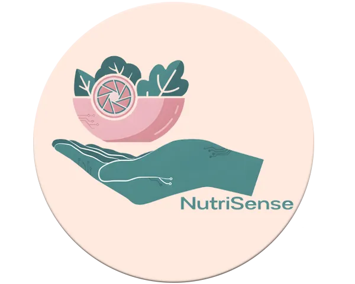

# NutriSense Website

Static landing page for the NutriSense web application.

## About

**Startup:** NutriSense  
**Course:** 1ASI0730 | Aplicaciones Web  
**Cycle:** 5  
**University:** Universidad Peruana de Ciencias Aplicadas  

## Team

| Name | Code |
| :---: | :---: |
| Del Aguila Del Aguila, Olenka Priscilla | U202411669 |
| Espinoza Cruz, Angela Milagros | U202415495 |
| Mora Rivera, Joel Fernando | U20241B227 |
| Vergraray Calderon, Rose Almendra | U20241D159 |
| Villarreal Bazan, Angel Martin | U202417857 |

## Deploy

[View live site](https://upc-pre-202610-1asi0730-12053-nutrisens.github.io/nutrisense-website/)

## Project Report

[NutriSense Report](https://github.com/upc-pre-202610-1asi0730-12053-nutrisens/nutrisense-report)